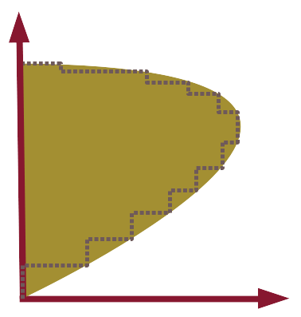

# BDisposal.jl

Non parametric efficiency and productivity analysis through the _B-disposal_ scheme

The BDisposal package proposes a serie of environmental efficiency and productivity algorithms for non-parametric modelling when we relax the disposability assumption of some of the outputs and/or inputs (e.g. pollution). These efficiency and productivity measures are implemented through convex and non-convex [Data Envelopment Analysis (DEA)](https://en.wikipedia.org/wiki/Data_envelopment_analysis) (aka _Frontier Efficiency Analysis_) models.

For installation and usage instructions, examples and references please refer to the official documentation:
- [**Stable**](https://sylvaticus.github.io/BDisposal.jl/stable): documentation relative to the stable version of BDisposal.jl
- [**Development**](https://sylvaticus.github.io/BDisposal.jl/dev): Documentation relative to the development version

 

## Acknowledgements

The development of this package at the _Bureau d'Economie Théorique et Appliquée_ (BETA, Nancy) was supported by the French National Research Agency through the [Laboratory of Excellence ARBRE](http://mycor.nancy.inra.fr/ARBRE/), a part of the “Investissements d'Avenir” Program (ANR 11 – LABX-0002-01).
 

