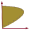

#  BDisposal.jl Documentation

Welcome to the documentation for the [_Non parametric productivity analysis under the B-disposal assumption_](https://github.com/sylvaticus/BDisposal.jl) package.

The BDisposal package proposes a serie of environmental efficiency and productivity algorithms for non-parametric modelling when we relax the disposability assumption of some of the outputs and/or inputs (e.g. pollution). These efficiency and productivity measures are implemented through convex and non convex [Data Envelopment Analysis (DEA)](https://en.wikipedia.org/wiki/Data_envelopment_analysis) (aka _Frontier Efficiency Analysis_) models.


## Installation

Until the BDisposal package is registered, please use:
* `] add git@github.com/sylvaticus/BDisposal.jl.git`
Once the BDisposal package will be included in the standard Julia register, install it with:
* `] add BDisposal.jl`

## Loading the module(s)

```julia
using BDisposal
```

## Usage

The BDisposal package contains two prominent components.
First, the BDisposal package defines environmental efficiency indicators for a set of Decision Making Units (`efficiencyScores()`), computing the distance to the best environmental production procedures, i.e., to the efficient production frontier.
Second, the BDisposal package displays environmental productivity indices (`prodIndex()`). These productivity measures are implemented for different time periods (eg., years, months etc.) or spatial units (eg., countries, cities etc.), based on the aforementioned environmental efficiency indicators.

Both components can consider constant or variable returns to scale, convex or non-convex production frontiers and additive or multiplicative distance functions, and work with multiple "good" ("desirable") and "bad" ("undesirable") inputs and outputs (with undesirable inputs being optional) (not all combinations are implemented, see the individual functions for details and limitations).

They are detailed in their respective pages:

- [**`efficiencyScores()`**](efficiencyScores.html): Compute efficiency indicators and convexity test results;
- [**`prodIndex()`**](prodIndex.html): Compute productivity indexes;

The package provides also a couple of functions to compute individual DMU problem using "vanilla" DEA (without considering the beta disposability assumption), [`dmuEfficiency`](@ref) and [`dmuEfficiencyDual`](@ref).

## Examples

### Airport example

The following example (with data from _Abad and Briec, 2019_) show how to compute the efficiency indicators for 14 main French airports, where the (good) inputs considered are _employees_ and _totalCosts_ and the (single in this case) bad and good outputs are respectively (airport) _co2emissions_ and _passengers_.


```julia
using DataFrames, CSV, BDisposal
println("Estimating French airports efficiency and productivity indexes...")

# Loading airport data and preparing the data..
# Data is stored as a  CSV files with 6 columns: period, dmu, co2emissions, passengers, employees, totalCosts
airportData = CSV.read(joinpath(dirname(pathof(BDisposal)),"test","data","airports.csv"),DataFrame; delim=';',copycols=true)
airportGoodInputs  = ["employees","totalCosts"]
airportBadInputs   = []
airportGoodOutputs = ["passengers"]
airportBadOutputs  = ["co2emissions"]
sort!(airportData, [:period, :dmu]) # sort data by period and dmu
periods = unique(airportData.period)
dmus    = unique(airportData.dmu)

nGI, nBI, nGO, nBO, nPer, nDMUs,  = length(airportGoodInputs), length(airportBadInputs), length(airportGoodOutputs), length(airportBadOutputs), length(periods),length(dmus)

# Setting empty containers for our data
# Each of them is a 3D matrix where the first dimension is the decision units, the second one is the individual input or output item and the third dimension is the period to which the data refer
gI = Array{Float64}(undef, (nDMUs,nGI,nPer)) # Good inputs
bI = Array{Float64}(undef, (nDMUs,nBI,nPer)) # Bad inputs (optional)
gO = Array{Float64}(undef, (nDMUs,nGO,nPer)) # Good outputs, aka "desiderable" outputs
bO = Array{Float64}(undef, (nDMUs,nBO,nPer)) # Bad outputs, aka "undesiderable" outputs
# Transferring data to the containers
for (p,period) in enumerate(periods)
    periodData = airportData[airportData.period .== period,:]
    gI[:,:,p] = convert(Matrix{Float64},periodData[:,airportGoodInputs])
    if nBI > 0
         bI[:,:,p] = convert(Matrix{Float64},periodData[:,airportBadInputs])
    end
    gO[:,:,p] = convert(Matrix{Float64},periodData[:,airportGoodOutputs])
    bO[:,:,p] = convert(Matrix{Float64},periodData[:,airportBadOutputs])
end

# Call the function to get the efficiency measurements for constant returns to scale
(λ, λ_convex, λ_nonconvex, nonConvTest, nonConvTest_value) = efficiencyScores(
gI,gO,bO,bI,retToScale="constant", dirGI=0,dirBI=0,dirGO=1,dirBO=-1, prodStructure="multiplicative")


# Add periods as headers and decision making names as first column in order to show the data
# Efficiency Indexes
λ = hcat(dmus,λ)
λdf = DataFrame(λ , Symbol.(vcat("DMU",periods)))
```

```
│ Row │ DMU                      │ 2007    │ 2008    │ 2009    │ 2010    │ 2011    │
│     │ Any                      │ Any     │ Any     │ Any     │ Any     │ Any     │
├─────┼──────────────────────────┼─────────┼─────────┼─────────┼─────────┼─────────┤
│ 1   │ Beauvais                 │ 1.0     │ 1.0     │ 1.0     │ 1.0     │ 1.0     │
│ 2   │ Bordeaux-Mérignac        │ 1.0     │ 1.0     │ 1.0     │ 1.0     │ 1.0     │
│ 3   │ Bâle-Mulhouse            │ 1.08295 │ 1.08777 │ 1.17694 │ 1.15278 │ 1.0     │
│ 4   │ Lille                    │ 1.13183 │ 1.15032 │ 1.06293 │ 1.0     │ 1.0     │
│ 5   │ Lyon-Saint Exupéry       │ 1.09567 │ 1.07909 │ 1.06901 │ 1.10468 │ 1.00911 │
│ 6   │ Marseille-Provence       │ 1.00071 │ 1.04287 │ 1.0     │ 1.0     │ 1.0     │
│ 7   │ Montpellier-Méditerranée │ 1.0     │ 1.0     │ 1.0     │ 1.10249 │ 1.14045 │
│ 8   │ Nantes-Atlantique        │ 1.09003 │ 1.05685 │ 1.0013  │ 1.05295 │ 1.07531 │
│ 9   │ Nice-Côte d'azur         │ 1.0     │ 1.02201 │ 1.02562 │ 1.08272 │ 1.02654 │
│ 10  │ Paris CDG                │ 1.14695 │ 1.14915 │ 1.15329 │ 1.17032 │ 1.17137 │
│ 11  │ Paris ORY                │ 1.21574 │ 1.22947 │ 1.21526 │ 1.22424 │ 1.21444 │
│ 12  │ Strasbourg-Entzheim      │ 1.0     │ 1.14408 │ 1.13534 │ 1.23498 │ 1.27062 │
│ 13  │ Toulouse-Blagnac         │ 1.0     │ 1.0     │ 1.0     │ 1.01143 │ 1.0     │
```
```julia
# Non-convexity test
nc_test = hcat(dmus,nonConvTest)
nc_test_df = DataFrame(nc_test , Symbol.(vcat("DMU",periods)))
```

```
│ Row │ DMU                      │ 2007 │ 2008 │ 2009 │ 2010 │ 2011 │
│     │ Any                      │ Any  │ Any  │ Any  │ Any  │ Any  │
├─────┼──────────────────────────┼──────┼──────┼──────┼──────┼──────┤
│ 1   │ Beauvais                 │ 1    │ 1    │ 1    │ 1    │ 1    │
│ 2   │ Bordeaux-Mérignac        │ 1    │ 1    │ 1    │ 1    │ 1    │
│ 3   │ Bâle-Mulhouse            │ 0    │ 0    │ 0    │ 0    │ 1    │
│ 4   │ Lille                    │ 0    │ 0    │ 0    │ 1    │ 1    │
│ 5   │ Lyon-Saint Exupéry       │ 1    │ 1    │ 1    │ 0    │ 1    │
│ 6   │ Marseille-Provence       │ 1    │ 0    │ 1    │ 1    │ 1    │
│ 7   │ Montpellier-Méditerranée │ 1    │ 1    │ 1    │ 1    │ 1    │
│ 8   │ Nantes-Atlantique        │ 0    │ 0    │ 1    │ 1    │ 1    │
│ 9   │ Nice-Côte d'azur         │ 1    │ 1    │ 1    │ 1    │ 1    │
│ 10  │ Paris CDG                │ 0    │ 0    │ 0    │ 0    │ 0    │
│ 11  │ Paris ORY                │ 0    │ 0    │ 0    │ 0    │ 0    │
│ 12  │ Strasbourg-Entzheim      │ 1    │ 1    │ 1    │ 1    │ 1    │
│ 13  │ Toulouse-Blagnac         │ 1    │ 1    │ 1    │ 0    │ 1    │
```

### OECD Example
Here we compute the productivity indexes of various OECD countries (with data from
[Jeon and Sickles (2004)](https://doi.org/10.1002/jae.769)) in terms of gdp growth over traditional production inputs as capital and labour, but also considering CO2 emissions and energy use.

```julia
using Test, DataFrames, CSV, BDisposal

# Loading data and formatting them in the way required by `prodIndex`
data = CSV.read(joinpath(dirname(pathof(BDisposal)),"..","test","data","js-data","oecd.txt"),DataFrame; delim=' ',ignorerepeated=true,copycols=true,header=false)
rename!(data,[:ccid,:year,:gdp,:co2,:capital,:labour,:energy])
dmuMap = Dict(1 => "Canada", 2 => "the United States", 3 => "Japan", 4 => "Austria",
              5 => "Belgium", 6 => "Denmark", 7 => "Finland", 8 => "France", 9 => "Germany",
              10 => "Greece", 11 => "Ireland", 12 => "Italy", 13 => "Norway", 14 => "Spain",
              15 => "Sweden", 16 => "U.K.", 17 => "Australia")
data.ccid = map(x->dmuMap[x], data.ccid)              

goodInputsLabels  = ["capital","labour"]
badInputsLabels   = ["energy"]
goodOutputsLabels = ["gdp"]
badOutputsLabels  = ["co2"]
sort!(data, [:year, :ccid]) # sort data by period and dmu
periods = unique(data.year)
dmus    = unique(data.ccid)

nGI, nBI, nGO, nBO, nPer, nDMUs,  = length(goodInputsLabels), length(badInputsLabels), length(goodOutputsLabels), length(badOutputsLabels), length(periods),length(dmus)

gI = Array{Float64}(undef, (nDMUs,nGI,nPer))
bI = Array{Float64}(undef, (nDMUs,nBI,nPer))
gO = Array{Float64}(undef, (nDMUs,nGO,nPer))
bO = Array{Float64}(undef, (nDMUs,nBO,nPer))

for (p,period) in enumerate(periods)
    periodData = data[data.year .== period,:]
    gI[:,:,p] = Matrix{Float64}(periodData[:,goodInputsLabels])
    if nBI > 0
        bI[:,:,p] =
         Matrix{Float64}(periodData[:,badInputsLabels])
    end
    gO[:,:,p] = Matrix{Float64}(periodData[:,goodOutputsLabels])
    bO[:,:,p] = Matrix{Float64}(periodData[:,badOutputsLabels])
end

# Performing the analysis
oecdAnalysis  = prodIndex(gI,gO,bO,bI;
                   retToScale="variable",prodStructure="multiplicative",convexAssumption=true)

# Showing production indexes for all countries..
pIdx = oecdAnalysis.prodIndexes

# Add periods as headers and decision making names as first column in order to show the data
# Efficiency Indexes
pIdx  = hcat(dmus,pIdx)
pIdxDf = DataFrame(pIdx, Symbol.(vcat("Country",periods[2:end])))
```
```
│ Row │ Country           │ 1981     │ 1982     │ 1983     │ 1984     │ 1985     │ 1986     │ 1987     │ 1988     │ 1989     │ 1990     │
│     │ Any               │ Any      │ Any      │ Any      │ Any      │ Any      │ Any      │ Any      │ Any      │ Any      │ Any      │
├─────┼───────────────────┼──────────┼──────────┼──────────┼──────────┼──────────┼──────────┼──────────┼──────────┼──────────┼──────────┤
│ 1   │ Australia         │ 0.977736 │ 0.930367 │ 1.02808  │ 0.922041 │ 0.903767 │ 0.981794 │ 0.926536 │ 0.933665 │ 0.900673 │ 0.911629 │
│ 2   │ Austria           │ 0.979773 │ 1.1484   │ 1.0755   │ 0.857465 │ 0.980912 │ 0.956835 │ 1.02945  │ 0.99305  │ 0.977884 │ 0.907733 │
│ 3   │ Belgium           │ 1.03689  │ 1.12484  │ 1.19398  │ 0.94616  │ 0.960489 │ 0.971912 │ 1.00726  │ 1.0175   │ 0.939892 │ 0.927984 │
│ 4   │ Canada            │ 1.08087  │ 1.12208  │ 1.00472  │ 0.92367  │ 0.908971 │ 1.0187   │ 0.942769 │ 0.861271 │ 0.946958 │ 1.07538  │
│ 5   │ Denmark           │ 1.17174  │ 1.14005  │ 1.11183  │ 0.92177  │ 0.789207 │ 1.01925  │ 0.971461 │ 1.09953  │ 1.01282  │ 1.07378  │
│ 6   │ Finland           │ 1.03309  │ 1.2081   │ 1.04533  │ 1.00031  │ 0.890516 │ 0.967695 │ 0.886199 │ 1.00992  │ 0.929423 │ 0.961372 │
│ 7   │ France            │ 1.16358  │ 1.09384  │ 1.0184   │ 1.03677  │ 0.956388 │ 1.07021  │ 0.99718  │ 1.0758   │ 0.892974 │ 0.963363 │
│ 8   │ Germany           │ 1.10511  │ 1.05712  │ 0.996193 │ 0.977022 │ 0.974394 │ 0.945363 │ 1.02082  │ 1.00494  │ 1.05994  │ 0.948425 │
│ 9   │ Greece            │ 1.00932  │ 1.05743  │ 0.905147 │ 0.938576 │ 0.893084 │ 0.946607 │ 0.866151 │ 0.857219 │ 0.959915 │ 0.894322 │
│ 10  │ Ireland           │ 1.07958  │ 1.08491  │ 1.02     │ 1.05953  │ 0.89387  │ 0.842009 │ 1.04458  │ 0.963471 │ 0.906481 │ 0.881976 │
│ 11  │ Italy             │ 0.995132 │ 1.04782  │ 1.03963  │ 0.966547 │ 0.944159 │ 0.993876 │ 0.879858 │ 0.995899 │ 0.922306 │ 1.00178  │
│ 12  │ Japan             │ 1.02888  │ 1.11865  │ 1.05006  │ 0.858129 │ 1.00571  │ 1.02974  │ 0.962465 │ 0.880748 │ 0.934798 │ 0.938167 │
│ 13  │ Norway            │ 1.13759  │ 1.12891  │ 0.91908  │ 0.895774 │ 0.875403 │ 0.931362 │ 0.865495 │ 1.18694  │ 0.91841  │ 1.01966  │
│ 14  │ Spain             │ 0.958627 │ 0.896678 │ 1.01058  │ 1.04446  │ 1.03482  │ 0.979829 │ 0.992774 │ 0.916314 │ 0.856962 │ 1.11224  │
│ 15  │ Sweden            │ 1.17011  │ 1.22715  │ 1.0454   │ 1.01861  │ 0.87206  │ 1.0145   │ 0.966368 │ 1.02     │ 1.10414  │ 1.0589   │
│ 16  │ U.K.              │ 1.08107  │ 1.08338  │ 0.964598 │ 0.981305 │ 0.94632  │ 0.974735 │ 0.97043  │ 1.00685  │ 0.948206 │ 0.978984 │
│ 17  │ the United States │ 1.05131  │ 1.1054   │ 1.00667  │ 0.905596 │ 1.00039  │ 0.996254 │ 0.935382 │ 0.914198 │ 0.972071 │ 0.983178 │
```

```julia
# Focusing on Austria decomposition
AustriaPIdx = vcat(oecdAnalysis.prodIndexes[2,:]',
     oecdAnalysis.prodIndexes_G[2,:]',
     oecdAnalysis.prodIndexes_B[2,:]',
     oecdAnalysis.prodIndexes_T[2,:]',
     oecdAnalysis.prodIndexes_E[2,:]',
     oecdAnalysis.prodIndexes_S[2,:]')

AustriaPIdx   = hcat(["Overall production indexes",
              "Decomposition for \"good\" inputs and outputs",
              "Decomposition for \"bad\" inputs and outputs",
              "Decomposition for the technological component",
              "Decomposition for the efficiency component",
              "Decomposition for the scale (residual) component",
              ],AustriaPIdx)


AustriaPIdxDf  = DataFrame(AustriaPIdx, Symbol.(vcat("Item",periods[2:end])))
```

```
│ Row │ Item                                             │ 1981     │ 1982    │ 1983     │ 1984     │ 1985     │ 1986     │ 1987     │ 1988     │ 1989     │ 1990     │
│     │ Any                                              │ Any      │ Any     │ Any      │ Any      │ Any      │ Any      │ Any      │ Any      │ Any      │ Any      │
├─────┼──────────────────────────────────────────────────┼──────────┼─────────┼──────────┼──────────┼──────────┼──────────┼──────────┼──────────┼──────────┼──────────┤
│ 1   │ Overall production indexes                       │ 0.950153 │ 1.13918 │ 1.08687  │ 0.861064 │ 0.996057 │ 0.96336  │ 1.04583  │ 1.02559  │ 1.00891  │ 0.930929 │
│ 2   │ Decomposition for "good" inputs and outputs      │ 0.969768 │ 0.99197 │ 1.01057  │ 1.0042   │ 1.01544  │ 1.00682  │ 1.01592  │ 1.03277  │ 1.03173  │ 1.02555  │
│ 3   │ Decomposition for "bad" inputs and outputs       │ 0.979773 │ 1.1484  │ 1.0755   │ 0.857465 │ 0.980912 │ 0.956835 │ 1.02945  │ 0.99305  │ 0.977884 │ 0.907733 │
│ 4   │ Decomposition for the technological component    │ 1.0192   │ 1.0416  │ 1.06671  │ 1.15647  │ 0.96198  │ 1.03854  │ 1.02924  │ 1.1261   │ 1.13558  │ 1.07684  │
│ 5   │ Decomposition for the efficiency component       │ 0.868255 │ 1.07801 │ 1.06762  │ 0.75353  │ 1.08088  │ 0.955791 │ 1.09237  │ 0.948266 │ 0.976689 │ 0.944898 │
│ 6   │ Decomposition for the scale (residual) component │ 1.0737   │ 1.01453 │ 0.954357 │ 0.988098 │ 0.957945 │ 0.970511 │ 0.930198 │ 0.960434 │ 0.909664 │ 0.914914 │
```

### Vanilla DEA Example

`BDisposal` provide also a simple function for "vanilla" DEA computation.
In this example we have 4 DMU with two inputs and one output, and we compute the
efficiency of the latest DMU:

```julia
I  = [10   2;
       8   4;
      12 1.5;
      24   3]
O =  [100;80;120;120]
I₀ = [24 3]
O₀ = [120]

results = dmuEfficiency(I₀,O₀,I,O)
```
```
(computed = true, eff = false, obj = 0.5, wI = [0.041666666666666664, 0.0], wO = [0.004166666666666667], refSet = Dict(3 => 1.0), othDMUsEffConstrDuals = [0.0, 0.0, 1.0, 0.0], iRegConstrDual = 0.5)
```
Here we see that the last DMU is not efficient (indeed it's coefficient is only 0.5) as it is "dominated" by the third DMU that is the only efficient DMU in this set.


## Other packages

This is a list of other Julia packages that use classical DEA method, although without relaxing the disposability assumption.

- [DataEnvelopmentAnalysis.jl](https://github.com/javierbarbero/DataEnvelopmentAnalysis.jl)
- [FrontierEfficiencyAnalysis.jl](https://github.com/wen-chih/FrontierEfficiencyAnalysis.jl)
- [SearchRef.jl](https://github.com/wen-chih/SearchRef.jl)
- [JuMP4DEA.jl](https://github.com/henry8527/JuMP4DEA.jl)


## References

- Abad, A. (2020) [Environmental Efficiency and Productivity Analysis](https://hal.inrae.fr/hal-03032038), _HAL_, 03032038
- Abad, A., P. Ravelojaona (2020a) [Pollution-adjusted Productivity Analysis: The Use of Malmquist and Luenberger Productivity Measures](https://doi.org/10.1002/mde.3260), _Managerial and Decision Economics_
- Abad, A., P. Ravelojoana (2020b) [A Generalization of Environmental Productivity Analysis](https://hal.inrae.fr/hal-02964799), _HAL_, 02964799
- Abad, A., W. Briec (2019) [On the Axiomatic of Pollution-generating Technologies: a Non-Parametric Approach](https://doi.org/10.1016/j.ejor.2019.02.027), _European Journal of Operational Research_, **277**(1), 377-390
- Abad, A. (2018) [Les Enseignements de la Micro-économie de la Production face aux Enjeux Environnementaux: Etude des Productions Jointes. Théorie et Applications](https://tel.archives-ouvertes.fr/tel-01963415), _Ph.D dissertation_, University of Perpignan.
- Abad, A., P. Ravelojaona (2017) [Exponential environmental productivity index and indicators](https://doi.org/10.1007/s11123-017-0513-7), _Journal of Productivity Analysis_, **48**(2), 147-166.
- Abad, A. (2015) [An environmental generalised Luenberger-Hicks-Moorsteen productivity indicator and an environmental generalised Hicks-Moorsteen productivity index](https://doi.org/10.1016/j.jenvman.2015.06.055), _Journal of Environmental Management_, **161**, 325-334.


## Acknowledgements

The development of this package at the _Bureau d'Economie Théorique et Appliquée_ (BETA, Nancy) was supported by the French National Research Agency through the [Laboratory of Excellence ARBRE](http://mycor.nancy.inra.fr/ARBRE/), a part of the “Investissements d'Avenir” Program (ANR 11 – LABX-0002-01).

[](http://www.beta-umr7522.fr/)
